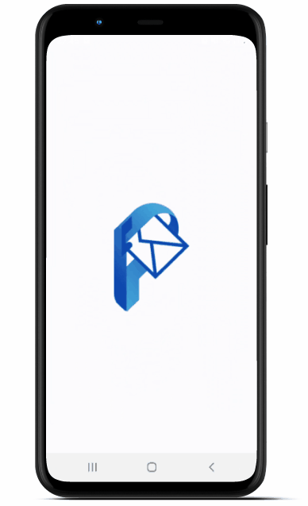

<h1 align="center">
    
</h1>
<p align="center">
  Aplicativo de Consulta de Correspondências
</p>

<div align="center">
  <a href="#information_source-sobre-o-projeto">Sobre o projeto</a> •
  <a href="#computer-tecnologias-utilizadas">Tecnologias utilizadas</a> •
  <a href="#rocket-como-executar">Como executar</a>
</div>

<br>

<p align="center">
  
</p>

# :information_source: Sobre o projeto

Este aplicativo faz parte de um projeto cuja finalidade é permitir que pessoas que não possuem entrega domiciliar de correspondências fique sabendo quando há correspondências para serem retiradas nas agências de serviço postal, para não "perder a viagem" 😁. As correspondências são cadastrados em uma [Aplicação Web](https://github.com/w-reis/postex-front-end) que, assim como o aplicativo, consome uma [API](https://github.com/w-reis/postex-api).

<br>

# :computer: Tecnologias utilizadas

### Este projeto foi desenvolvido utilizando as seguintes tecnologias:

- [NodeJs](https://nodejs.org/en/docs/)
- [Typescript](https://www.typescriptlang.org/)
- [React Native](https://reactnative.dev/)
- [Axios](https://github.com/axios/axios)
- [Context API](https://reactjs.org/docs/context.html)
- [EditorConfig](https://editorconfig.org/)
- [ESLint](https://eslint.org/)
- [Prettier](https://prettier.io/)
- [react-native-vector-icons](https://github.com/oblador/react-native-vector-icons)
- [React Navigation](https://reactnavigation.org/)
- [styled-components](https://styled-components.com/)
- [Unform](https://unform.dev/)
- [Yup](https://github.com/jquense/yup)

<br>

# :rocket: Como executar

### :iphone: Executando o projeto no dispositivo mobile

  Para clonar e executar este aplicativo, você precisará do [Git](https://git-scm.com), [Node.js](https://nodejs.org) + [Yarn](https://yarnpkg.com) instalado no seu computador. Também é ideal possuir um editor para trabalhar com o código como [Visual Studio Code](https://code.visualstudio.com/).
<p>Para visualizar o aplicativo você irá precisar de um celular ou um emulador de android/ios.</p>

### :arrow_down: Baixando o projeto 

```bash
# Clone o repositório na sua máquina
$ git clone https://github.com/w-reis/postex-mobile.git
```
Depois de clonado, execute os comandos a seguir:

```bash
# Vá para a pasta do projeto
$ cd postex-mobile/

# Instale as dependências
$ yarn install

#Execute a aplicação
$ yarn android ou yarn ios
$ yarn start
```

<br>

Feito com paixão por [Wellinton Reis](https://github.com/w-reis) 🚀.

Dê uma ⭐️ se este projeto ajudou você!
